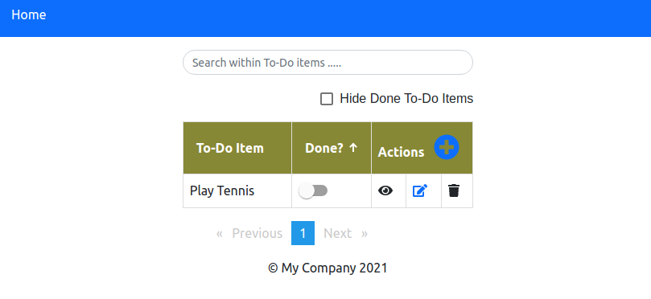
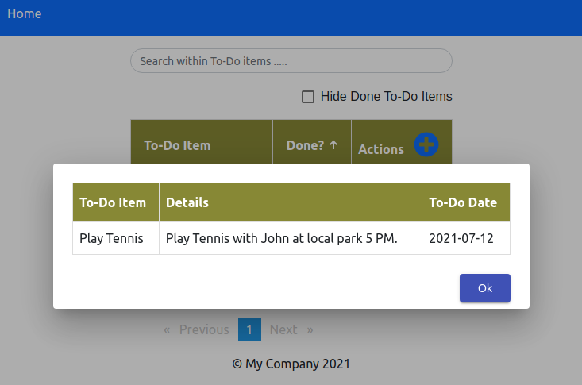

The `todo-api` app leverages Java 8 RESTful Web Services to store and retrieve data using MySQL.
The `todo-client` app leverages angular 10 to todo-api app.


# To-Do API
### Build & Run
```
cd todo-api
mvn clean install
```
Maven will compile the project and generate the jar file in the `target` directory.

The successful output will look like this:

```
[INFO] --- maven-install-plugin:2.5.2:install (default-install) @ todo-api ---
[INFO] Installing /home/anavulla/MY_DATA/Work/sts_workspace/todo-app/todo-api/target/todo-api-0.0.1-SNAPSHOT.jar to /home/anavulla/.m2/repository/com/mycom/todo-api/0.0.1-SNAPSHOT/todo-api-0.0.1-SNAPSHOT.jar
[INFO] Installing /home/anavulla/MY_DATA/Work/sts_workspace/todo-app/todo-api/pom.xml to /home/anavulla/.m2/repository/com/mycom/todo-api/0.0.1-SNAPSHOT/todo-api-0.0.1-SNAPSHOT.pom
[INFO] ------------------------------------------------------------------------
[INFO] BUILD SUCCESS
[INFO] ------------------------------------------------------------------------
[INFO] Total time:  4.865 s
```
You can now go to target folder to launch the todo-api using command line
```
java -jar todo-api-0.0.1-SNAPSHOT.jar
```

How you run this code is up to you, but usually you would start by using an IDE like Eclipse. The .classpath and .settings are available to run this on IDE.

Once the todo-api is running in your local, Rest services are accesible at http://localhost:8080 (assuming 8080 is default port) 

### Database Setup

The mysql script files are available under  `/src/main/java/resources` 
* `dabatabse.sql`

This script needs to be executed under `root` user to setup app user, database, along with privileges.

* `schema.sql`

This script can be executed as part of the application run, update the flag **mysql.schema.file.execute** to ***true*** in `application.properties`.

Please make sure that **spring.datasource.username** & **spring.datasource.password** matches with values from `database.sql` if you want to customize them.

>> **Note**: If you set to true, this will drop the table and re-create it on the app launch, this is intended for development use only.

# To-Do Client
### Build & Run
```
cd todo-client
npm install 
ng serve
```
The client app can be accessible on http://localhost:4200 (assuming 4200 is default port)

## Screenshots

### icon details


### add new to-do item


### fill to-do item details


### home screen after save


### view more details


### edit to-do item


### toggle to mark to-do item as done 
##### (more items added)


### search
